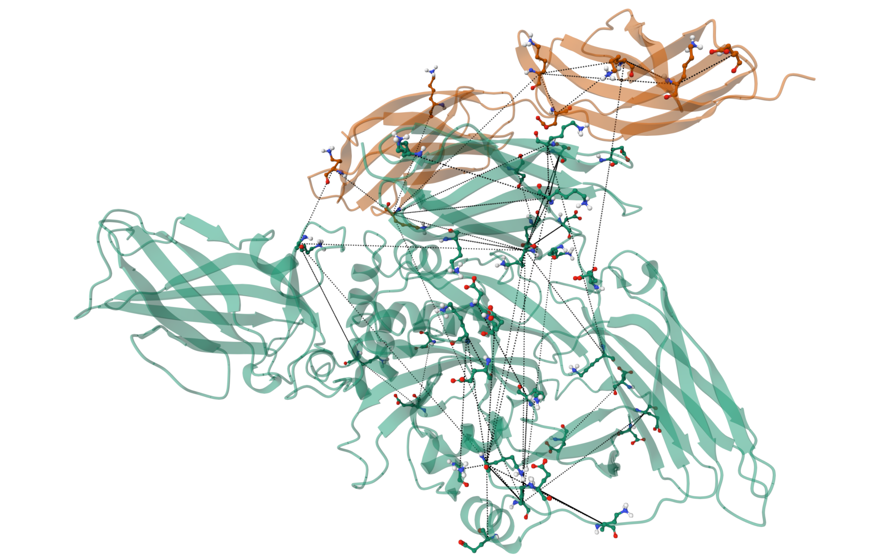
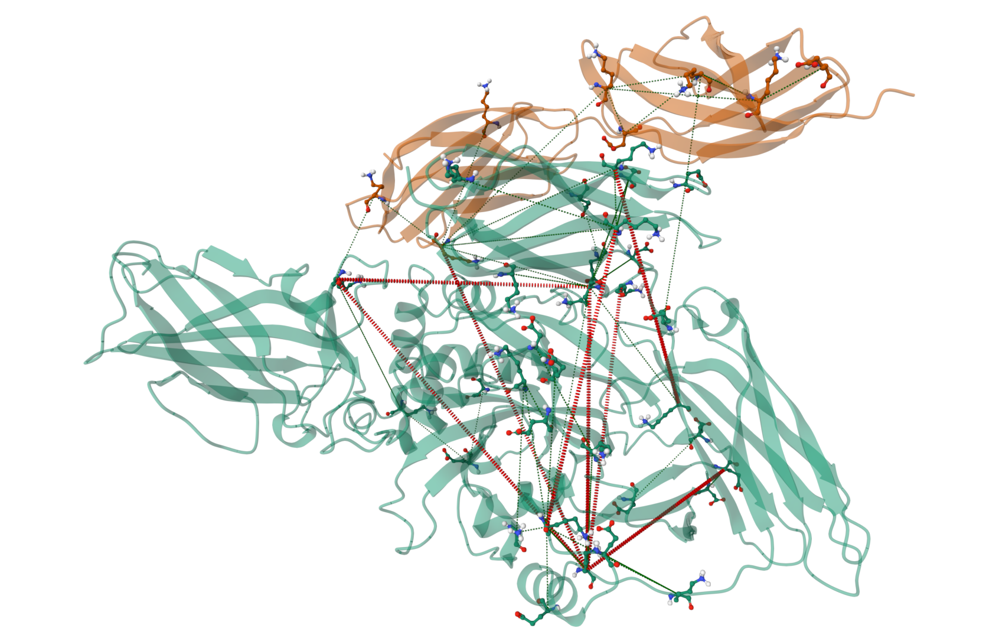
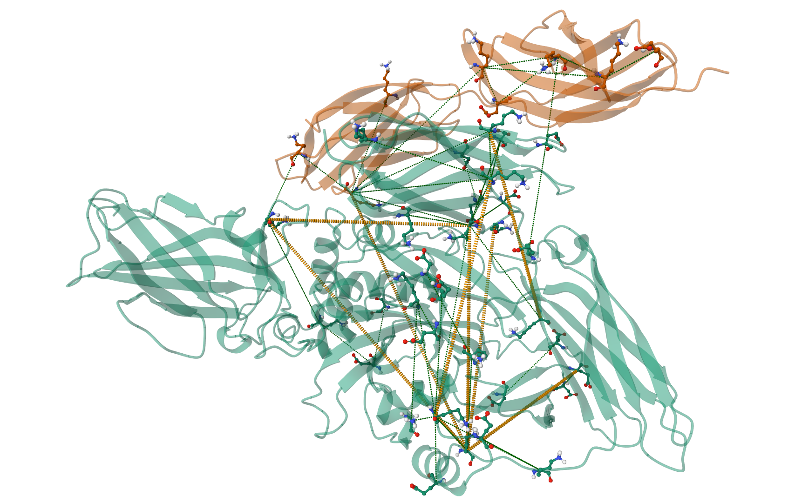
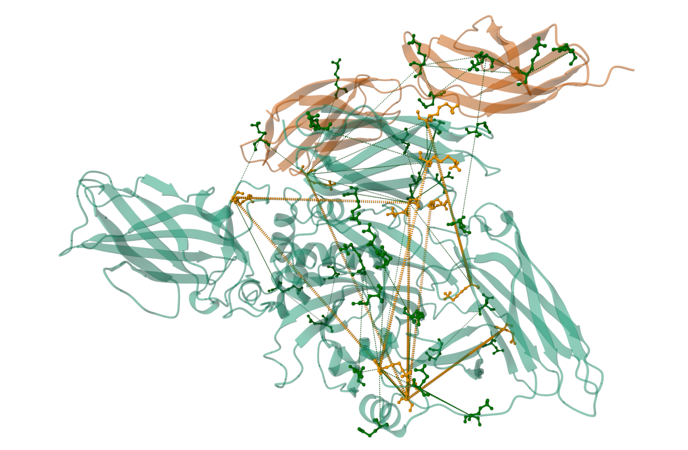
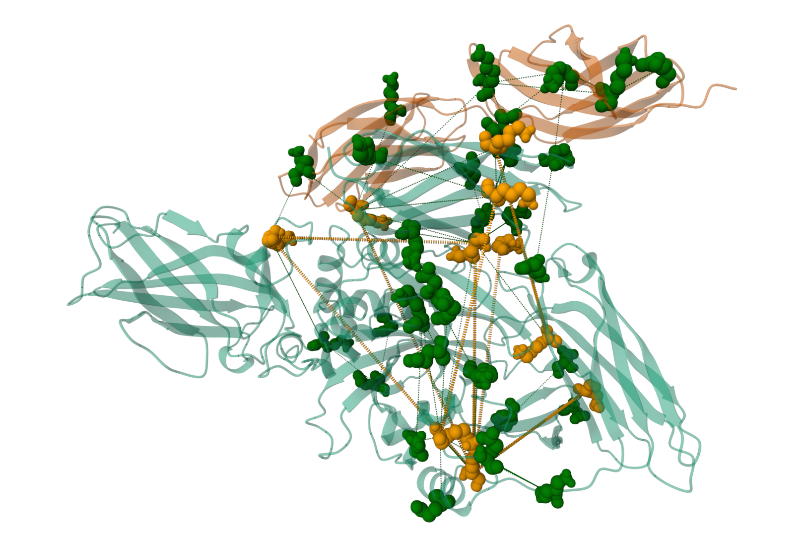
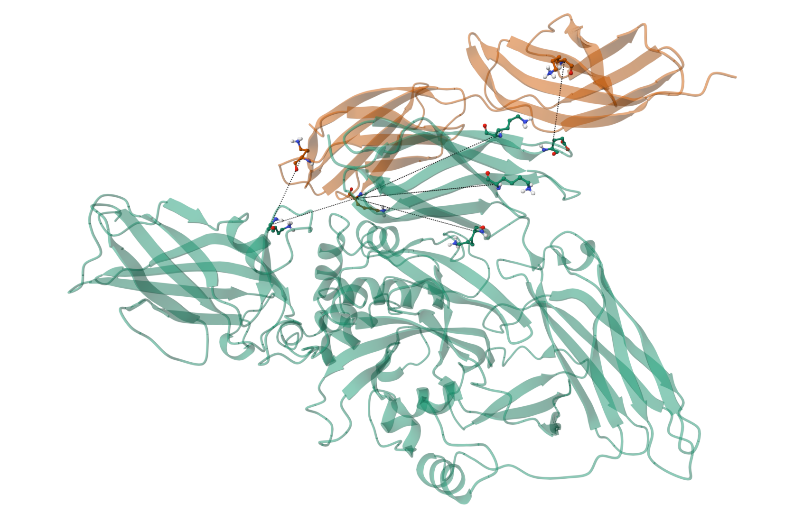
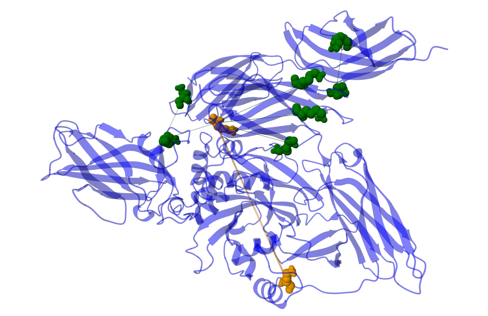

ihm-molstar-mvs
==============================
[//]: # (Badges)
[](https://github.com/REPLACE_WITH_OWNER_ACCOUNT/restraint_vis/actions?query=workflow%3ACI)
[](https://codecov.io/gh/REPLACE_WITH_OWNER_ACCOUNT/ihm-molstar-mvs/branch/main)


## `ihm_vis`

This repository contains utilities that support data-driven visualization of integrative structures through Molstar using MolViewSpec.

We provide a Python interface for reading mmCIF files, parsing relevant restraint information, and visualizing the macromolecule and its restraints flexibly and reproducibly. Our package comes with a command line program `visualize_restraints` that covers many of the basic use cases, however, additional customization can be had by calling the underlying package code in your own scripts if desired.

Here, we will focus mostly on the CLI program `visualize_restraints`, which takes in a CIF file path or url and creates a `.mvsj` scene file. Additional details for importing `ihm_vis` and scripting are provided in the 'for developers' section.


## Installation

Requirements:
  - linux or macOS
  - git
  - A conda or virtualenv with Python >= 3.9
  - pip

Clone this repository:

```bash
git clone https://github.com/ihmwg/ihm-molstar-mvs.git
```

Enter the directory:

```bash
cd ihm-molstar-mvs
```

Install:

```bash
pip install .
```


## Usage Guide

### Basic Usage

The `visualize_restraints` command takes one positional argument: the url or local file path of a CIF file

```bash
visualize_restraints https://pdb-ihm.org/cif/9a3v.cif
```

This will create the file `9a3v.mvsj`, which when loaded into Mol* will visualize tissue transglutaminase 2 in complex with plasma fibronectin type III along with `50` of its `64` experimental cross-link restraints. 





or if you have a local file

```bash
visualize_restraints /path/to/my_file.cif
```

will create `my_file.mvsx`, a molviewspec archive which bundles the underlying structure file `my_fie.cif` with the `my_file.mvsj` scene. 


We only see `50` of the `64` restraints in `9a3v.cif` because `visualize_restraints` defaults to randomly sampling `50` restraints. To adjust this, you can use the `-n` or `--max_restraints` flag:

```bash
visualize_restraints https://pdb-ihm.org/cif/9a3v.cif -n 100
```

which will now show up to `100` restraints. 

The `-o` or `--output` argument will specify the name of the output file, which defaults to the basename of the input file.

The `-t` or `--title` argument will set the "title" in the mvsj metadata

And the `-v` or `--verbose` flag will enable verbose output. 

To see all command line options use `visualize_restraints --help`
```
usage: visualize_restraints [-h] [-n MAX_RESTRAINTS]
                            [-f {first_n,random_sample,across_chains,within_chains,violated,compliant} [{first_n,random_sample,across_chains,within_chains,violated,compliant} ...]]
                            [-s {violated_and_compliant,inter_and_intra_chain}] [-c STYLE_FILE] [-o OUTPUT] [-t TITLE] [-v] [--random_state RANDOM_STATE]
                            cif_file

Visualize CIF file structures with IHM restraint data using ihm_vis.

positional arguments:
  cif_file              Path or URL of CIF file

options:
  -h, --help            show this help message and exit
  -n MAX_RESTRAINTS, --max_restraints MAX_RESTRAINTS
                        Maximum number of restraints to visualize, this value will be used if the 'first_n' or 'random_sample' filters are applied.
  -f {first_n,random_sample,across_chains,within_chains,violated,compliant} [{first_n,random_sample,across_chains,within_chains,violated,compliant} ...], --filter {first_n,random_sample,across_chains,within_chains,violated,compliant} [{first_n,random_sample,across_chains,within_chains,violated,compliant} ...]
                        Filter(s) to apply to restraint table. You can specify multiple to chain filters together.
  -s {violated_and_compliant,inter_and_intra_chain}, --sub_style_mode {violated_and_compliant,inter_and_intra_chain}
                        Sub-style mode for coloring on a per-restraint basis
  -c STYLE_FILE, --style_file STYLE_FILE
                        Optional YAML or JSON file to customize visual style of macromolecule, restraint residues, or restraint distance primitives
  -o OUTPUT, --output OUTPUT
                        Output file name. Note! when using a local file a .mvsx archive will be created bundling the .mvsj file with the CIF file. Defaults to CIF file
                        stem.
  -t TITLE, --title TITLE
                        Title for mvsj file. Defaults to input name of input CIF file.
  -v, --verbose         Verbose outputs
  --random_state RANDOM_STATE
                        random state for reproducible random sampling. Defaults to 27.
```

                        

### Styling based on restraints and user specified styles

By default, the style of all restraints will be the same - ie there is no differentiation between violated and compliant restraints or inter vs intra chain restraints. 

To differentiate between restraints, `ihm_vis` has a notion of `sub_styles`. Different sub_styles can be conditionally applied to residues and modify or override some aspect of their visual style. For example, you may want to the distance marker of a violated restraint as `red` and compliant restraints `green`. This happens to be one of the built-in `sub_style_modes` availible through the `visualize_restraint` CLI:

```bash
visualize_restraints https://pdb-ihm.org/cif/9a3v.cif -s violated_and_compliant
```





The `-s` or `--sub_style_mode` argument specifies *how* the restraints should be differentiated. There are currently two available modes:

  - `violated_and_compliant`: differentiates between compliant and violated restraints
  - `intrer_and_intra_chain`: differentiates between inter and intra chain restraints


By default, the color of the tubes are changed depending on which category the restraint falls in (green for compliant, red for violated, magenta for inter chain, and blue for intra chain). But, this is easily customizable on the command line by providing user specified style in either json or yaml format. 

Let's say we wanted to differentiate by `violated_and_compliant`, but instead of `red` we want the violated restraint distance markers to be `orange`.

my_style.yaml
```yaml
distance:
  violated:
    distance_params: 
      color: "orange"
```

The structure of the yaml file is as follows:
  - top level: the "type" of thing to style, either "macromolecule", "component", or "distance". Here, "macromolecule" refers to the non-restraint related visualizations, ie the protein itself. "component" refers to the endpoints of the distance restraints, most of the time indivudual residues. "distance" refers to the distance primitives drawn between restraint endpoints
  - second level: the `sub_style` name you want to style. In this case, we wanted to change how the violated restraints would look, therefore we specify the `sub_style` of "violated"
  - third level: the parameters to update. The distance primitive only has one parameter group, which is the distance_params. For "macromolecule" and "component" there may be more, such as "representation_params", which will be shown in subsequent exmaples. 
  - fourth level: the parameter values. We wanted to style the violated distance tubes to be `orange`, so we specify `color: "orange"`. 


```bash
visualize_restraints https://pdb-ihm.org/cif/9a3v.cif -s violated_and_compliant -c my_style.yaml
```

The `-c` or `--style_file` flag is used to specify our custom style, resulting in the below visualization.





We can also affect the residues within a restraint. If we wanted to also color the residues within a restraint based on whether it was violated or compliant we can add the violated sub_style for "component"s. Note, precedence is taken by violated restraints when a residue particulates in multiple restraints.

my_style.yaml
```yaml
distance:
  violated:
    distance_params: 
      color: "orange"

component:
  violated:
    color_params: 
      color: "orange"
      custom: null

  compliant:
    color_params:
      color: "green"
      custom: null
```

```bash
visualize_restraints https://pdb-ihm.org/cif/9a3v.cif -s violated_and_compliant -c my_style.yaml
```




**Why did we have to say "custom: null"? And what would happen if we didn't?**

Each type of visual ("macromolecule", "component", and "distance") has a base sub_style called "default". The `ihm_vis` package sets the "component" default to:

```
component:
  default:
    representation_params:
      type: "ball_and_stick"
      size_factor: 0.7

    color_params:
      custom: 
        molstar_color_theme_name: "element-symbol"
```

which colors the hetero atoms of the residue by element. The styling in `ihm_vis` is hierarchical, so each sub_style inherits all the styles of the default sub_style. This means that if we did not specify `custom: null`, we would inherit that parameter and while the carbons on the residue would be colored how we expect, the oxygen, nitrogen, and hydrogen would still be colored by element: 

Setting `custom: null` removes this parameter so it is not inherited from the default sub_style.


This hierarchical styling scheme is useful for easily controlling parameters for all "component"s. For example, the `size_factor` is set in the "component" default sub_style to ensure that the ball_and_stick representation of all residues is consistent. 

To demonstrate this, we can also set all the residues to be visualized as spacefill instead of ball_and_stick, while still retaining their violated/compliant styling.


my_style.yaml
```yaml
distance:
  violated:
    distance_params: 
      color: "orange"

component:
  default:
    representation_params:
        type: "spacefill"

    color_params: 
      custom: null

  violated:
    color_params: 
      color: "orange"

  compliant:
    color_params:
      color: "green"
```





For more information on custom styling, see style api page


### Filtering restraints

Finally, we can also apply one or more filters to the restraints. The `-f` or `--filter` argument allows you to specify a filter to apply from 

  - `first_n`: takes first `n` restraints, where `-n` or `--max_restraints` specifies `n`
  - `random_sample`: randomly samples `n` restraints, where `n` or `--max_restraints` specifies `n`
  - `across_chains`: filters to only restraints whose endpoints originate on separate asym_ids 
  - `within_chains`: filters to only restraints whose endpoints originate on the same asym_id
  - `violated`: filters to only restraints whose solved distance violates the experimental restraint distance
  - `compliant`: filters to only restraints whose solved distance complies with the experimental restraint distance


You can specify multiple `-f` arguments to chain the filters together. For example, to see only the compliant intra-chain restraints call:

```bash
visualize_restraints https://pdb-ihm.org/cif/9a3v.cif -f compliant across_chains
```




## All-in-one Example

Showcase most of the features in one big example. Not intended to be the prettiest visualization, but shows many examples of customizability.

my_style.yaml
```yaml
macromolecule:                  # set style for macromolecule
    color_params:
      color: "blue"             # set color to blue

distance:                       # set style of distance marker 
  violated:                     # sub_style of violated
    distance_params: 
      color: "orange"           # set color to orange

component:                      # set style of residues at either end of restraint
  default:                      # sub_style of default (inherited by all others)
    representation_params:  
        type: "spacefill"       # make spacefill 
        size_factor: 0.75       # tweak the size a bit

    color_params:               
      custom: null              # override the ihm_vis default of color by atom

  violated:                     # sub_style of violated
    color_params: 
      color: "orange"           # set color to orange

  compliant:                    # sub_style of compliant
    color_params:
      color: "green"            # set color to green
```


```bash
visualize_restraints https://pdb-ihm.org/cif/9a3v.cif -f across_chains -s violated_and_compliant -c my_style.yaml
```

The `-f across_chains` filters to restraints whose endpoints are on different asym_ids. 

The `-s violated_and_compliant` styles the restraints based on if they violate or comply with experimental distance measurements.

The `-c my_style.yaml` provides our modified style.





#### Acknowledgements
 
Project based on the 
[Computational Molecular Science Python Cookiecutter](https://github.com/molssi/cookiecutter-cms) version 1.10.
